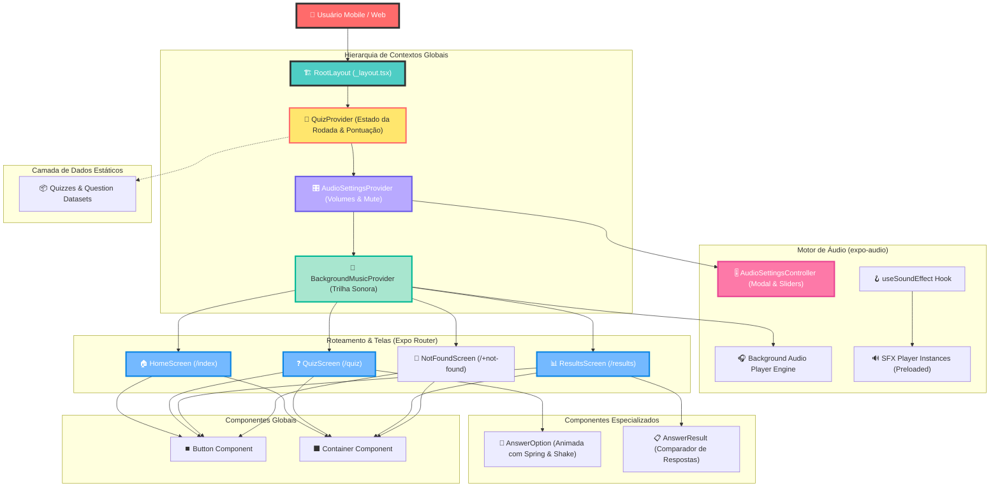

# QuizApp — ISTs: Prevenção, Saúde e Conscientização

> _Gamificação e rigor pedagógico no letramento em saúde sexual: transformando informação crítica sobre Infecções Sexualmente Transmissíveis em experiência interativa de alto engajamento._

---

## 📲 Download Rápido (APK Android)

[](https://github.com/AzazelCastro/QuizApp/releases/tag/v1.0.0)

> **Para avaliadores e testadores:** Não é necessário configurar o ambiente Node/Expo para testar a aplicação. Baixe o executável Android compilado diretamente na [Release v1.0.0](https://github.com/AzazelCastro/QuizApp/releases/tag/v1.0.0).

---

## Abstract (Resumo Técnico)

A disseminação de informações imprecisas e estigmatizantes acerca de Infecções Sexualmente Transmissíveis (ISTs), somada à baixa adesão da população jovem aos canais formais de comunicação em saúde coletiva, impõe a necessidade de ferramentas educacionais digitais contemporâneas, dinâmicas e baseadas em evidências científicas. O **QuizApp** foi concebido como uma aplicação móvel focada em letramento em saúde, estruturada em torno de mecânicas de gamificação diagnóstica e formativa aplicadas à conscientização sobre HIV/AIDS, estratégias de prevenção combinada (como PrEP e PEP), testagem diagnóstica e quebra de estigmas associados.

Construído sob o ecossistema multiplataforma **React Native** com **Expo SDK 57**, TypeScript e **Expo Router**, o projeto emprega uma arquitetura declarativa orientada a contextos reativos (`QuizContext`, `AudioSettingsContext` e `BackgroundMusicContext`). O sistema integra um motor de controle de áudio granular com pipeline assíncrono via `expo-audio`, suporte a animações visuais fluidas com a API nativa `Animated` e transições táteis, proporcionando uma experiência imersiva com feedback auditivo e cinestésico instantâneo. A aplicação entrega avaliação pedagógica contínua, revisão estruturada de alternativas comentadas e métricas detalhadas de desempenho individual.

---

## Badges

[](LICENSE)
[](https://reactnative.dev/)
[](https://expo.dev/)
[](https://www.typescriptlang.org/)
[](https://docs.expo.dev/router/introduction/)

---

## Sumário

- [📲 Download Rápido (APK Android)](#-download-rápido-apk-android)
- [Abstract (Resumo Técnico)](#abstract-resumo-técnico)
- [Sumário](#sumário)
- [Introdução e Motivação](#introdução-e-motivação)
- [Arquitetura do Sistema](#arquitetura-do-sistema)
- [Decisões de Design Chave](#decisões-de-design-chave)
- [✨ Funcionalidades Detalhadas](#-funcionalidades-detalhadas)
- [🛠️ Tech Stack Detalhado](#️-tech-stack-detalhado)
- [📂 Estrutura Detalhada do Código-Fonte](#-estrutura-detalhada-do-código-fonte)
- [📋 Pré-requisitos](#-pré-requisitos)
- [🚀 Guia de Instalação e Execução](#-guia-de-instalação-e-execução)
- [⚙️ Uso Avançado e Exemplos](#️-uso-avançado-e-exemplos)
- [🔧 API Reference](#-api-reference)
- [🧪 Estratégia de Testes e Qualidade de Código](#-estratégia-de-testes-e-qualidade-de-código)
- [🚢 Deployment Detalhado e Escalabilidade](#-deployment-detalhado-e-escalabilidade)
- [⚠️ Isenção de Responsabilidade Médica](#️-isenção-de-responsabilidade-médica-medical-disclaimer)
- [📜 Licença e Aspectos Legais](#-licença-e-aspectos-legais)

---

## Introdução e Motivação

O acesso democratizado à informação em saúde é um dos pilares da saúde pública contemporânea. No entanto, tabus culturais, falta de diálogo qualificado e estigmas persistentes criam barreiras consideráveis para a compreensão adequada das ISTs, dos métodos preventivos modernos (tais como Profilaxia Pré-Exposição — PrEP, e Profilaxia Pós-Exposição — PEP) e do conceito fundamental de **Indetectável = Intransmissível (I=I)**.

Muitas iniciativas educacionais digitais tradicionais limitam-se a textos monótonos ou questionários estáticos, falhando em reter o foco do usuário ou em fornecer feedback pedagógico imediato. O **QuizApp** surge para solucionar essa lacuna por meio de uma abordagem interativa de gamificação, que alia:

1. **Acurácia Científica:** Questões elaboradas com foco na desmistificação e nas diretrizes contemporâneas de saúde pública.
2. **Imersão Multissensorial:** Efeitos sonoros customizados para acertos, erros e seleções, acompanhados de trilhas de fundo contextuais controláveis.
3. **Reforço Positivo e Análise Crítica:** Tela de resultados abrangente, que contextualiza cada resposta errada ou correta, incentivando o aprendizado corretivo imediato.

---

## Arquitetura do Sistema

A aplicação foi estruturada seguindo o padrão de **Camadas Modulares Orientadas a Domínio**, orquestrada pelo sistema de roteamento baseado em arquivos do **Expo Router**. O fluxo de estado global e áudio é encapsulado através de Providers React contextuais que operam em hierarquia decoupled.

### Diagrama de Arquitetura



### Detalhamento dos Componentes

- **`QuizProvider`:** Mantém o índice da pergunta ativa, o vetor cumulativo de respostas do usuário (`UserAnswer[]`), o cálculo de porcentagem de acertos (`PercentageCorrectAnswers`) e o cálculo do nível de desempenho (`PercentageCorrectAnswersLevel`).
- **`AudioSettingsProvider` & `AudioSettingsController`:** Controla canais separados para Efeitos Sonoros (SFX) e Música de Fundo (BGM), persistindo estados de mudo e níveis de atenuação volumétrica. O `AudioSettingsController` disponibiliza um Floating Action Button (FAB) com modal transparente contendo sliders independentes.
- **`BackgroundMusicProvider` & `useBackgroundMusic`:** Gerencia a reprodução da música ambiente com transição suave entre telas com base no foco de navegação (`useFocusEffect`), respeitando prioridades de reprodução (ex: na tela de resultados, a música aguarda o jingle de vitória/derrota terminar).
- **`useSoundEffect`:** Abstração reativa para disparo de efeitos sonoros de curta latência com suporte a `downloadFirst` e rebobinagem imediata (`seekTo(0)`).

---

## Decisões de Design Chave

1. **Separação de Canais de Áudio:** Efeitos visuais e auditivos operam de forma dissociada. Usuários têm o direito de silenciar a música de fundo enquanto mantêm os alertas de acerto/erro, ou vice-versa, preservando a acessibilidade sensorial.
2. **Pré-carregamento de Mídia (`preload` via `expo-audio`):** Para evitar atrasos indesejados (_audio latency_) no feedback do usuário ao selecionar ou submeter respostas, os assets de áudio são declarados e pré-carregados durante a montagem dos módulos de tela.
3. **Animações Nativas via Driver Nativo (`useNativeDriver`):** Componentes interativos como `AnswerOption` executam animações de resposta (*shake* e *spring*) enviando o fluxo de interpolação diretamente para a thread nativa antes da execução, utilizando a propriedade `useNativeDriver: true`. Isso garante alta performance a 60 FPS sem gargalos na thread principal do JavaScript.
4. **Tipagem Estrita de Dados (TypeScript):** Todo o fluxo de dados (`Quiz`, `Question`, `QuestionOption`, `AnswerId`, `UserAnswer`) possui validação em tempo de compilação, eliminando cenários de referência nula ou índices fora de alcance.
5. **Estabilidade de Referência em Memória (`useMemo` e `useCallback`):** Para evitar o problema de renderizações em cascata comum na Context API do React, todos os valores expostos pelos Provedores (`QuizProvider`, `AudioSettingsProvider`, `BackgroundMusicProvider`) têm suas referências memorizadas, garantindo que atualizações de estado específicas re-renderizem apenas os componentes estritamente dependentes.

---

## ✨ Funcionalidades Detalhadas

| Funcionalidade                            | Descrição Técnica                                                                                                                                     | Caso de Uso                                                                                                                           |
| :---------------------------------------- | :---------------------------------------------------------------------------------------------------------------------------------------------------- | :------------------------------------------------------------------------------------------------------------------------------------ |
| **Questionário Dinâmico e Gamificado**    | Iteração orientada a estado que bloqueia seleção após submissão, destacando em verde/vermelho a alternativa do usuário e a resposta correta.          | O estudante seleciona a alternativa desejada, clica em "Responder", escuta o som correspondente e visualiza imediatamente se acertou. |
| **Painel de Controle de Áudio Global**    | Floating Action Button (FAB) acessível em qualquer tela com controle independente de volume/mudo para Trilha e Efeitos Sonoros.                       | Um usuário em ambiente público pode silenciar a trilha de fundo sem interromper o feedback sonoro das respostas.                      |
| **Feedbacks Multissensoriais Integrados** | Animações dinâmicas de _shake_ em caso de erro e _spring zoom_ em acertos, acompanhadas de efeitos sonoros pré-carregados.                            | O usuário recebe confirmação visual e auditiva instantânea da precisão de sua escolha.                                                |
| **Auditoria e Revisão de Resultados**     | Tela de encerramento contendo percentual consolidado, categorização qualitativa (_excellent, high, medium, low_) e lista comparativa de cada questão. | O usuário analisa detalhadamente quais perguntas errou, revisando a resposta que escolheu em contraste com a alternativa correta.     |
| **Roteamento Seguro com Fallback**        | Gerenciamento centralizado de rotas tipadas pelo Expo Router, incluindo tratamento de exceções de rota via `+not-found.tsx`.                          | Tentativas de acesso a rotas inválidas direcionam o usuário de volta à página inicial de forma limpa.                                 |

---

## 🛠️ Tech Stack Detalhado

| Categoria            | Tecnologia                            | Versão          | Propósito no Projeto                       | Justificativa da Escolha                                                             |
| :------------------- | :------------------------------------ | :-------------- | :----------------------------------------- | :----------------------------------------------------------------------------------- |
| **Core Framework**   | React Native                          | `0.86.3`        | Camada base de renderização móvel          | Alta performance, renderização nativa em iOS e Android.                              |
| **Plataforma / SDK** | Expo                                  | `~57.0.18`      | Plataforma de desenvolvimento e compilação | Agilidade de build, suporte a typed routes e ecossistema moderno.                    |
| **Linguagem**        | TypeScript                            | `~6.0.3`        | Tipagem estática em toda a base de código  | Segurança de tipos em tempo de desenvolvimento e documentação viva.                  |
| **Roteamento**       | Expo Router                           | `~57.0.17`      | Navegação estruturada em arquivos          | Roteamento declarativo com deep linking e tipagem estática de rotas.                 |
| **Sistema de Áudio** | `expo-audio`                          | `~57.0.4`       | Controle de players de áudio, SFX e BGM    | Módulo de áudio moderno do ecossistema Expo SDK 57.                                  |
| **Animações**        | `Animated` (React Native API)     | `0.86.3`         | Animações de microinterações e transições  | Execução fluida de física e transições na thread nativa de UI.                       |
| **Interface / UI**   | `@react-native-community/slider`      | `5.2.0`         | Ajuste contínuo de volumes de som          | Componente leve e preciso para controles analógicos de áudio.                        |
| **Ícones**           | `@react-native-vector-icons/ionicons` | `^13.1.3`       | Iconografia visual da aplicação            | Conjunto de ícones universal, escalável e leve.                                      |
| **Build & Deploy**   | Expo Application Services (EAS)       | CLI `>= 22.4.0` | Automação de builds em nuvem (APK/AAB)     | Facilidade para gerar artefatos nativos sem necessidade de toolchain local completa. |

---

## 📂 Estrutura Detalhada do Código-Fonte

```
QuizApp/
├── assets/                          # Recursos de mídia estáticos
│   ├── images/                      # Ícones e splash screen da aplicação
│   │   ├── icon.png
│   │   └── splash-icon.png
│   └── sounds/                      # Faixas de áudio e efeitos sonoros (.mp3)
│       ├── bad-result.mp3
│       ├── correct.mp3
│       ├── good-result.mp3
│       ├── home-background.mp3
│       ├── incorrect.mp3
│       ├── quiz-background.mp3
│       ├── result-background.mp3
│       └── selected.mp3
├── src/                             # Código-fonte principal da aplicação
│   ├── app/                         # Roteamento baseado em arquivos (Expo Router)
│   │   ├── _layout.tsx              # Layout raiz com injeção dos Providers globais
│   │   ├── index.tsx                # Rota '/' (Home)
│   │   ├── quiz.tsx                 # Rota '/quiz' (Sessão do Questionário)
│   │   ├── results.tsx              # Rota '/results' (Tela de Pontuação)
│   │   └── +not-found.tsx           # Fallback para rotas inexistentes
│   ├── components/                  # Componentes reutilizáveis e agnósticos
│   │   ├── Button/                  # Botão customizado com suporte a variantes de tamanho e cor
│   │   └── Container/               # Invólucro de tela com suporte a Safe Area e ScrollView
│   ├── contexts/                    # Gerenciadores de estado global (Context API)
│   │   ├── AudioSettings/           # Controle volumétrico e persistência de mudo
│   │   ├── BackgroundMusic/         # Orquestração do player de música de fundo
│   │   └── Quiz/                    # Lógica de negócio, pontuação e respostas
│   ├── data/                        # Datasets estáticos estruturados
│   │   ├── questions.ts             # Banco de questões sobre ISTs com alternativas e gabarito
│   │   └── quizzes.ts               # Metadados e mensagens contextuais de resultado
│   ├── hooks/                       # Custom React Hooks
│   │   ├── useBackgroundMusic.ts    # Acoplamento de BGM ao ciclo de vida da tela
│   │   └── useSoundEffect.ts        # Gerenciador de instâncias de efeitos sonoros curtos
│   ├── screens/                     # Visualizações de tela decompostas
│   │   ├── Home/                    # Tela inicial de boas-vindas e início do quiz
│   │   ├── NotFound/                # Tela amigável de erro 404
│   │   ├── Quiz/                    # Visão interativa com opções e animações de feedback
│   │   └── Results/                 # Visão consolidada de acertos, mensagens e gabarito
│   ├── theme/                       # Paleta de cores, tipografia e tokens visuais
│   │   └── index.ts
│   └── types/                       # Definições de interfaces e tipos estritos TypeScript
│       └── quiz.ts
├── app.json                         # Configurações do ecossistema Expo e metadados nativos
├── eas.json                         # Configuração de pipelines de build do Expo Application Services
├── package.json                     # Declaração de dependências e scripts de automação
└── tsconfig.json                    # Configurações do compilador TypeScript e path mappings
```

---

## 📋 Pré-requisitos

Antes de iniciar o ambiente de desenvolvimento, assegure-se de que sua máquina possui as seguintes ferramentas configuradas:

- **Node.js**: Versão `>= 20.x` (LTS recomendada).
- **Gerenciador de Pacotes**: `npm` `>= 10.x` ou `yarn` `>= 1.22.x`.
- **Expo CLI**: Integrado ao projeto via `npx expo`.
- **EAS CLI** _(Opcional, para compilação de binários)_: `npm install -g eas-cli`.
- **Ambiente Mobile de Testes**:
  - Dispositivo físico com aplicativo **Expo Go** instalado (Android/iOS), ou
  - **Android Studio** com emulador AVD configurado (Android API 33+), ou
  - **Xcode** com simulador iOS configurado (somente macOS).

---

## 🚀 Guia de Instalação e Execução

Escolha uma das duas formas abaixo para testar ou desenvolver o QuizApp:

### Opção A: Instalação Direta no Dispositivo (APK Standalone)

Para testar o aplicativo em um dispositivo Android real sem a necessidade de instalar Node.js ou ferramentas de desenvolvimento:

1. Acesse a página oficial de lançamentos: [GitHub Release v1.0.0](https://github.com/AzazelCastro/QuizApp/releases/tag/v1.0.0).
2. Faça o download do arquivo `QuizApp.apk` diretamente no seu smartphone Android.
3. Abra o arquivo baixado e autorize a instalação de fontes desconhecidas no Android, caso solicitado.
4. Abra o QuizApp instalado na sua gaveta de aplicativos.

### Opção B: Configuração para Desenvolvimento (Código-Fonte)

Certifique-se de ter todos os [pré-requisitos](#-pré-requisitos) para rodar o projeto.

#### 1. Clonagem do Repositório

```bash
git clone https://github.com/AzazelCastro/QuizApp.git
cd QuizApp
```

#### 2. Instalação das Dependências

Instale rigorosamente os pacotes validados no arquivo de lock:

```bash
npm install
```

#### 3. Inicialização do Servidor de Desenvolvimento

Para iniciar o servidor Metro Bundler do Expo:

```bash
npx expo start
```

#### 4. Execução em Plataformas Específicas

- **Android (Emulador ou Dispositivo Conectado via ADB):**
  ```bash
  npx expo start --android
  ```
- **iOS (Simulador macOS):**
  ```bash
  npx expo start --ios
  ```
- **Web (Modo Experimental):**
  ```bash
  npx expo start --web
  ```

##### 🌐 Notas sobre Suporte e Limitações no Modo Web

Embora a aplicação possa ser executada no navegador via `npx expo start --web`, o foco primário do **QuizApp** é a experiência nativa em dispositivos móveis (Android/iOS). Caso opte por testar a versão Web, esteja ciente das seguintes especificidades de plataforma:

* **Políticas de *Autoplay* de Áudio nos Browsers:** Navegadores modernos (como Chrome, Safari e Edge) possuem políticas rígidas que bloqueiam a reprodução automática de músicas de fundo (`BackgroundMusicProvider`) até que o usuário realize o primeiro clique ou interação direta na tela.
* **Comportamento do `expo-audio`:** Recursos avançados de pré-carregamento dinâmico e mixagem de canais de áudio podem apresentar comportamento assíncrono ligeiramente diferente do runtime nativo em dispositivos Android e iOS.

---

## ⚙️ Uso Avançado e Exemplos

### Adicionando Novas Questões ao Dataset

O banco de questões é completamente desacoplado e extensível. Para adicionar novas perguntas, edite o arquivo `src/data/questions.ts`:

```typescript
import { Question } from "@/types/quiz";

export const questions: Question[] = [
	// ... questões existentes
	{
		id: 14,
		question:
			"O que caracteriza o conceito 'Indetectável = Intransmissível' (I=I)?",
		options: [
			{
				id: "a",
				text: "Pessoas com HIV indetectável há pelo menos 6 meses em tratamento não transmitem o vírus por via sexual.",
			},
			{
				id: "b",
				text: "O vírus foi totalmente curado e eliminado do organismo.",
			},
			{
				id: "c",
				text: "A pessoa não precisa mais realizar exames de acompanhamento.",
			},
			{
				id: "d",
				text: "Indica apenas que a pessoa não apresenta sintomas aparentes.",
			},
		],
		correctAnswer: "a",
	},
];
```

### Personalização da Identidade Visual (Design Tokens)

Todas as cores da interface são tipadas e centralizadas em `src/theme/index.ts`. Para customizar os tons principais:

```typescript
export const theme = {
	colors: {
		background: "#0d1529",
		backgroundDark: "#010515",
		surface: "#787f89",
		primary: "#7007e7", // Cor primária de destaque
		accent: "#a683ff", // Cor de destaque nas seleções
		success: "#00a43b", // Indicador de acerto
		error: "#ea003e", // Indicador de erro
		text: "#F2F2F7",
		// ...
	},
};
```

---

## 🔧 API Reference

> **Nota Arquitetural:** O QuizApp opera prioritariamente como uma Single Page Application / Mobile App autossuficiente (_Offline-First_). Não consome APIs REST/GraphQL remotas no ciclo de vida padrão do questionário, garantindo latência zero e operação sem internet.

### Estruturas de Dados Centrais (`src/types/quiz.ts`)

#### `Question`

```typescript
interface Question {
	id: number;
	question: string;
	options: QuestionOption[];
	correctAnswer: AnswerId; // 'a' | 'b' | 'c' | 'd'
}
```

#### `UserAnswer`

```typescript
interface UserAnswer {
	questionId: number;
	selectedAnswer: AnswerId;
	correct: boolean;
}
```

#### `QuizContextData`

| Assinatura                | Tipo                     | Descrição                                     |
| :------------------------ | :----------------------- | :-------------------------------------------- |
| `quiz`                    | `Quiz`                   | Objeto de configuração do quiz atual          |
| `currentQuestion`         | `number`                 | Índice baseado em 0 da pergunta em exibição   |
| `currentQuestionAnswered` | `boolean`                | Flag de bloqueio pós-submissão                |
| `score`                   | `number`                 | Quantidade total de acertos                   |
| `userAnswers`             | `UserAnswer[]`           | Histórico sequencial de escolhas do usuário   |
| `answerQuestion`          | `(id: AnswerId) => void` | Registra e valida a resposta da questão atual |
| `nextQuestion`            | `() => void`             | Avança o ponteiro de questão                  |
| `resetQuiz`               | `() => void`             | Reinicializa todo o estado da sessão          |

---

## 🧪 Estratégia de Testes e Qualidade de Código

A integridade do software é sustentada por práticas de checagem estática e padronização:

### Verificação de Tipos (Type Checking)

```bash
npx tsc --noEmit
```

### Análise Estática de Código (Linting)

```bash
npx expo lint
```

### Testes de Interface e Regras de Negócio (Recomendação de Extensão)

Recomenda-se a utilização de **Jest** com **React Native Testing Library** (`@testing-library/react-native`) para asserções nos reducers dos Contextos e testes unitários dos hooks de cálculo de pontuação (`percentageCorrectAnswers`).

---

## 🚢 Deployment Detalhado e Escalabilidade

### Geração de APK/AAB via Expo Application Services (EAS Build)

O projeto está configurado via `eas.json` para compilação em nuvem de artefatos standalone para Android:

#### 1. Login no EAS

```bash
eas login
```

#### 2. Compilação de APK Preview (Distribuição Direta)

```bash
eas build --profile preview --platform android
```

#### 3. Compilação de Produção para Google Play Store (AAB)

```bash
eas build --profile production --platform android
```

---

## ⚠️ Isenção de Responsabilidade Médica (Medical Disclaimer)

> **AVISO IMPORTANTE:** O **QuizApp** é uma ferramenta digital desenvolvida com fins estritamente **educativos, informativos e pedagógicos**. 
>
> 1. As informações contidas no aplicativo **não constituem e não substituem** consulta, diagnóstico, tratamento ou aconselhamento médico profissional.
> 2. Se você suspeita de infecção, teve uma exposição de risco ou busca orientação médica sobre métodos preventivos (como **PrEP** e **PEP**), procure imediatamente uma Unidade Básica de Saúde (**UBS**), um Centro de Testagem e Aconselhamento (**CTA**) do **SUS**, ou consulte um médico infectologista/especialista de sua confiança.
> 3. Nunca ignore ou atrase a busca por atendimento médico profissional devido a informações obtidas neste aplicativo.

---

## 📜 Licença e Aspectos Legais

Este projeto está distribuído sob a licença **MIT**. Para maiores informações sobre termos de uso, reprodução e modificação, consulte o arquivo [LICENSE](./LICENSE).
